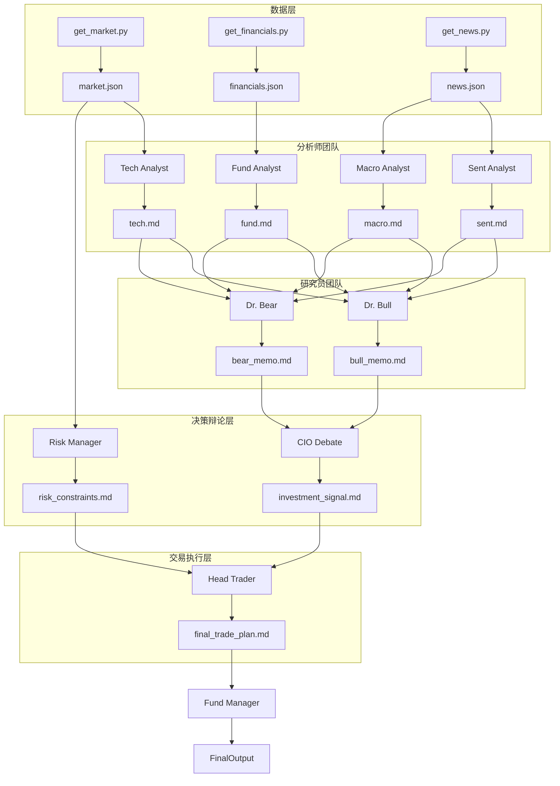

# TradingAgents 2.0: 完整角色谱系实施规范 (Full Spectrum Implementation)

## 1. 系统架构 DAG (有向无环图)



## 2. Agent 角色与 Prompt 定义 (`.gemini/prompts/`)

我们需要为上述 DAG 中的每个节点创建独立的 Prompt 文件。

### Level 1: Analysts
*   `tech.md`: 输出趋势、支撑压力。
*   `fund.md`: 输出估值、质量。
*   `sent.md`: 输出情绪分、叙事。
*   `macro.md`: 输出宏观环境 (Risk-on/off)。

### Level 2: Researchers
*   `bull.md`: 读取所有 Level 1 报告，只找买入理由。
*   `bear.md`: 读取所有 Level 1 报告，只找做空理由。

### Level 3: Decision Makers
*   `debate.md`: 对比 Bull/Bear 观点，给出最终 Signal (Buy/Sell/Hold)。
*   `risk.md`: 读取市场波动率，给出仓位限制和止损位。

### Level 4: Execution
*   `trader.md`: 综合 Signal 和 Risk，写出具体挂单策略。

### Level 5: Orchestrator
*   `manager.md`: 汇总所有信息，向用户做最终陈述。

## 3. 编排脚本逻辑 (`orchestrator.sh`)

脚本必须严格按照 **依赖顺序** 执行。不能并行启动所有 Agent，必须分层级。

```bash
# 1. Fetch Data
python tools/get_market.py ... > agency/data/market.json &
...
wait

# 2. Run Analysts (Parallel)
gemini run ... > agency/reports/tech.md &
gemini run ... > agency/reports/fund.md &
...
wait

# 3. Run Researchers (Parallel)
gemini run "Read reports/tech.md, fund.md..." ... > agency/reports/bull_memo.md &
gemini run ... > agency/reports/bear_memo.md &
wait

# 4. Run Debate & Risk (Parallel)
gemini run "Read bull_memo.md, bear_memo.md..." ... > agency/reports/signal.md &
gemini run "Read data/market.json..." ... > agency/reports/risk.md &
wait

# 5. Run Trader
gemini run "Read signal.md, risk.md..." ... > agency/reports/plan.md

# 6. Final Output
cat agency/reports/plan.md
```

## 4. 实施步骤
1.  **基础设施**: 创建目录。
2.  **Prompt 工程**: 编写 9 个独立的 Prompt 文件。
3.  **编排器编写**: 实现上述的分层等待 (`wait`) 逻辑。
4.  **CLI 绑定**: `/agency:run` 指向该脚本。