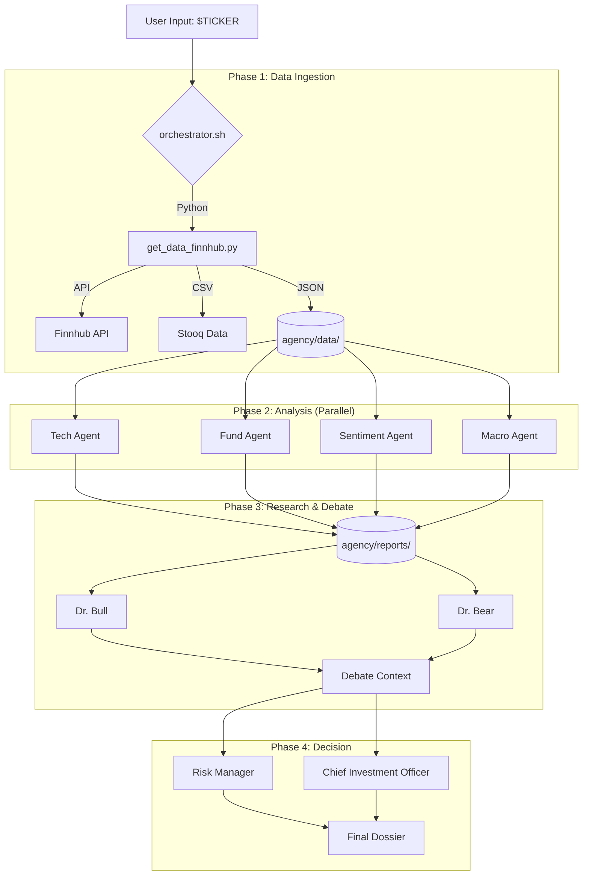

# TradingAgents 2.0 (MVP)

A **Recursive Multi-Agent System** for autonomous stock research and analysis, powered by **Gemini CLI**.

## 🚀 Key Features

*   **Agentic Architecture**: Uses `files-as-state` to orchestrate multiple specialized AI agents (Tech Analyst, Fund Manager, Risk Officer, Debater).
*   **Hybrid Data Pipeline**: Combines **Finnhub API** (Real-time Price/Financials) and **Stooq** (Historical CSV) for robust, key-friendly data ingestion.
*   **Parallel Execution**: Agents run concurrently as independent processes, coordinated by a central Bash orchestrator.
*   **Debate System**: "Dr. Bull" and "Dr. Bear" agents debate the thesis before the final "Fund Manager" makes a decision.

## 🛠️ Architecture



## 📦 Installation

1.  **Clone the repository**:
    ```bash
    git clone <repo-url>
    cd tradingagents
    ```

2.  **Install dependencies**:
    ```bash
    pip install -r requirements.txt
    ```
    *(Requirements: `requests`, `pandas`, `numpy`, `python-dotenv`)*

3.  **Configure Environment**:
    Create a `.env` file and add your Finnhub API Key (Free Tier supported):
    ```bash
    echo "FINNHUB_API_KEY=your_actual_key_here" > .env
    ```

## 🚦 Usage

Run the orchestrator with a stock ticker symbol:

```bash
bash orchestrator.sh NVDA
```

The system will:
1.  Fetch real-time data.
2.  Dispatch 4 analyst agents.
3.  Simulate a debate.
4.  Generate a comprehensive Markdown report in the terminal.

## 📂 Directory Structure

*   `orchestrator.sh`: The "Bus" that connects everything.
*   `tools/`: Python scripts for hard data acquisition.
*   `.gemini/prompts/`: The "Brain" (System Prompts) for each agent.
*   `agency/`: The "Memory" (Data and Reports).

## ⚠️ Disclaimer
This is an experimental AI research tool. **NOT FINANCIAL ADVICE.**
